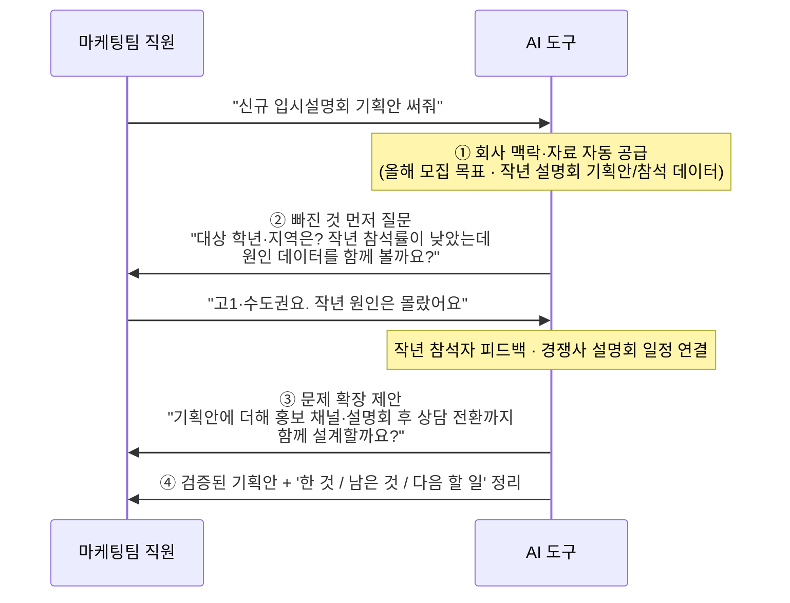
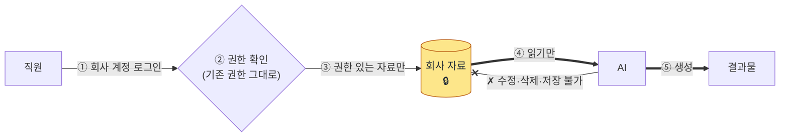
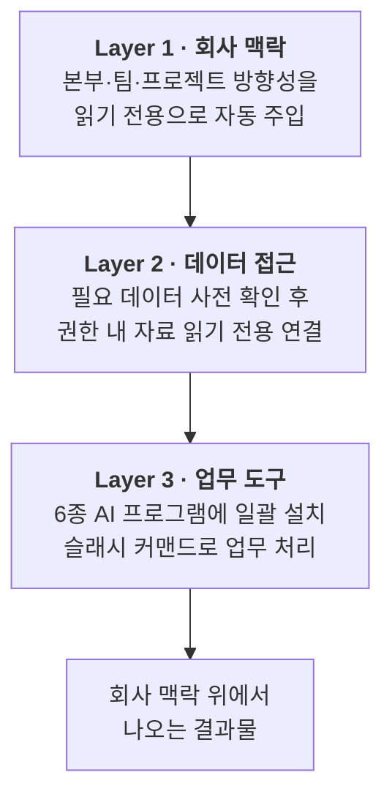

# 회사 맥락 기반 AI 업무 도구 도입 보고

> 발표 5분 + Q&A. 각 섹션 상단의 **핵심 메시지**가 구두 발표용 요지이며, 그 아래는 상세 근거(질문 대비)입니다.

---

## 1. 현황과 문제 정의

**핵심 메시지** — 직원들은 이미 AI를 쓰고 있으나 결과물이 평범합니다. AI 성능 문제가 아니라, AI가 '우리 회사'를 모르고 '우리 데이터'에 닿지 못하기 때문입니다.

- **회사 맥락 부재** — 직원이 일을 시킬 때 본부 방향성·팀 목표·프로젝트 이해관계자·과거 결정을 매번 설명해야 합니다. 대부분 생략하므로 AI는 일반론만 답하고, 결과물이 비즈니스와 동떨어집니다.
- **데이터 단절** — 자료가 Teams·OneDrive·노션·피그마에 흩어져 있어 직원이 찾고 정리하는 데 시간을 씁니다. 더 큰 문제는 연결이 안 된 상태에서 AI가 추측으로 일하는 것이며, 이 경우 결과를 신뢰할 수 없습니다.

> 본 과제의 목표는 'AI를 더 똑똑하게'가 아니라, **AI에 회사 맥락과 실제 데이터를 자동으로 공급하는 것**입니다.

---

## 2. 전사 강제 도입이 가능한가

**핵심 메시지** — 강제를 위한 도구·시스템이 일부 존재하긴 하지만, 모두 "특정 도구에만" 통하거나 최신 도구에서 막혀 전 직원 일괄 강제는 비현실적입니다. 그래서 본 과제는 '강제'가 아닌 '자연스러운 정착'을 택했습니다.

조사 결과, 강제 수단은 세 갈래가 있으나 각각 한계가 분명합니다.

| 강제 방법 | 실제 제품·방식 (조사) | 쉬운 설명 | 한계 |
| --- | --- | --- | --- |
| 도구별 관리자 콘솔 | Claude Code 관리형 설정(MDM) · GitHub Copilot Enterprise · Cursor Team/Enterprise | 각 도구 제조사가 제공하는 회사 전용 통제 기능 | 자기 도구만 통제 → 직원이 다른 도구를 쓰면 무력화 |
| 통합 AI 중계 서버(게이트웨이) | LiteLLM · Portkey · TrueFoundry | 모든 AI 통신을 회사가 만든 한 곳으로 모아 통제 (접속 주소를 회사 서버로 고정) | 도구가 그 경로를 따라줄 때만 작동 |
| 네트워크 차단 | SASE · 포워드 프록시 + 회사 인증서 | 회사 망에서 특정 AI 접속 자체를 차단 | 도구마다 접속 방식이 다르고 수시로 바뀌어 빠짐없이 막기 어려움 |

- **결정적 한계 — 최신 도구일수록 막힌다** — Cursor의 자동화(에이전트) 모드와 구글 Antigravity는 AI 통신이 제조사 서버에 직접 잠겨 있어, 회사 중계 서버로 우회시키거나 중간에서 가로채는 것이 불가능합니다(실제로 가로채기 실패 사례 다수). 신형 도구일수록 "제조사 서버 직결" 구조라 통제가 더 어려워지는 추세입니다.
- **현실적 절충** — 굳이 강제가 필요하다면, 통제가 가능한 일부 도구(예: Claude Code · Codex · Antigravity의 명령줄(CLI) 버전)로 허용 범위를 좁히는 방법뿐입니다.

> 결론적으로 본 과제는 강제 대신, **어떤 도구를 쓰든 회사 맥락이 자동으로 묻어나게 만드는** 방식을 택했습니다. (다음 §3·§5)

---

## 3. 해결 방안과 기대 효과

**핵심 메시지** — 직원은 '무엇을 하려는지'만 전달하면, 회사 맥락·필요 데이터·검증을 도구가 자동으로 채웁니다. 한발 더 나아가, 직원이 '무엇이 필요한지조차 모를 때'도 도와주고, 당면 문제 해결에 그치지 않고 더 나은 방향으로 업무를 넓혀 줍니다.

직원을 돕는 방식은 세 가지이며, 아래 예시에서 ①②③으로 표시했습니다.

- **① 맥락·데이터 자동 공급** — 회사 방향성과 권한 내 자료를 자동으로 깔아주어, 매번 배경을 설명하지 않아도 됩니다.
- **② '필요한 줄도 몰랐던 것'을 짚어줌** — 어떤 암묵지·데이터가 필요한지 직원이 인지하지 못해도, 인터뷰식 질문으로 빠진 맥락을 먼저 확인합니다.
- **③ 문제를 넓혀 줌** — 시킨 일만 좁게 처리하지 않고, 질의응답으로 당면 문제를 넘어 더 나은 접근·놓친 기회까지 제안합니다.

> *예시 — 마케팅팀 직원이 "신규 입시설명회 기획안 써줘"라고 요청하는 경우*

아래는 도구가 직원과 인터뷰식으로 주고받는 실제 흐름입니다.

같은 사례로, 현재와 도입 후가 어떻게 다른지:

| 도와주는 방식 | 현재 (도구 없이) | 도입 후 — 입시설명회 기획안 예시 |
| --- | --- | --- |
| ① 맥락·데이터 자동 공급 | 본부 목표·작년 자료를 직접 찾아 붙여넣음 | 올해 모집 목표·작년 설명회 기획안/참석 데이터를 자동으로 깔아줌 |
| ② 필요한 줄도 몰랐던 것 짚어줌 | 무엇이 빠졌는지 모른 채 진행 | "대상 학년·지역은? 작년 참석률 저조 원인 데이터를 보시겠어요?"라고 먼저 질문 |
| ③ 문제를 넓혀 줌 | 시킨 기획안만 작성 | "홍보 채널·설명회 후 상담 전환까지 함께 설계할까요?"로 범위 확장 제안 |
| 신뢰 확보 | 전 내용을 직접 검증 | 답변 끝에 '한 것 / 남은 것 / 다음 할 일' 자동 정리 |

> 위 사례는 설명용 예시입니다. 보고 시 자사 실제 업무 사례로 교체하면 설득력이 높아집니다.

---

## 4. 보안 및 데이터 보호 체계

**핵심 메시지** — AI는 자료를 읽기만 할 뿐 변경할 수 없으며, 직원은 기존 권한이 있는 자료만 열람합니다. 자료가 회사 외부의 새 시스템에 쌓이지 않습니다.

> 흐름은 '자료 → AI → 결과물' 한 방향뿐입니다. AI가 자료를 되돌려 바꾸는 경로(점선 ✗)는 아예 존재하지 않습니다.

4가지 안전장치가 구조적으로 설계되어 있습니다.

1. **읽기 전용** — 도구에 자료를 수정·삭제할 권한 자체가 없습니다. 편집은 권한 보유자가 웹에서 직접 할 때만 가능합니다.
2. **기존 권한 체계 준수** — 회사의 Microsoft 로그인·권한 그룹을 그대로 사용합니다. 권한이 없던 직원은 AI를 통해서도 열람할 수 없으며, 인사이동은 기존 권한 관리만으로 자동 반영됩니다.
3. **외부·미인가 접근 차단** — 회사 정식 계정만 접속 가능하며, 외부 메일·게스트 계정은 거부됩니다. 기존 단말·위치 보안정책이 그대로 적용됩니다.
4. **외부 AI 전송 동의 절차** — 답변 생성을 위해 일부 내용이 외부 AI(예: Claude)로 전송됩니다. 이 사실을 직원에게 명시하고 동의를 받으며, 1급 기밀은 별도 등급으로 분리 통제합니다.

> 'AI가 어떤 자료까지 접근할 수 있는가'의 접근 등급은 보안팀과 확정해야 하며, 이는 구현의 최대 전제조건입니다.

---

## 5. 자체 구축의 타당성 (Build vs Buy)

**핵심 메시지** — 범용 AI는 우리 회사를 모르는 외부 도구입니다. 본 과제는 우리 회사를 아는 내부 도구를 만드는 것이며, 특정 AI 사업자에 종속되지 않습니다.

| 구분 | 범용 도구 (ChatGPT 기업용·Copilot) | 본 과제 |
| --- | --- | --- |
| 회사 맥락 | 없음 (범용 비서) | 본부·팀·프로젝트 방향성 기반 동작 |
| 데이터 접근 | 직원이 수동 입력 | 권한 내 자료 자동·읽기전용 연결 |
| 도구 종속성 | 해당 사업자 제품에 종속 | Claude·Cursor 등 6종에 일괄 적용, 종속 없음 |
| 비용 | 별도 구독료 | 보유 M365 기반, 신규 인프라 0 |

---

## 6. 비용 및 추진 현황

**핵심 메시지** — 신규 인프라 비용은 0이며, 보유 중인 Microsoft 365 위에서 동작합니다. 도구 기반은 이미 작동하고 있고, 회사 맥락·데이터 연결은 보안팀·IT 협조 확정 시 본격 구현에 착수합니다.

비용

| 구분 | 내용 | 규모 |
| --- | --- | --- |
| 신규 인프라 | SharePoint·인증 = 보유 M365 포함 | 0원 |
| AI 사용료 | 사용량 기반 (외부 AI API) | `[측정 필요]` |
| 구축 인력 | 개발 `[N명] × [기간]` | `[확정 필요]` |
| 운영 | 자료 최신성 관리 | 본부별 담당자 지정 |

추진 현황

| 구성 요소 | 상태 |
| --- | --- |
| 배포 도구 (npm 패키지·커맨드 8종) | 초기 버전 동작 |
| 인터뷰 모드 (필요 데이터 사전 확인) | 구현 완료 |
| 회사 맥락 자동 주입 (Layer 1) | 미구현 — 보안·조직도 확정 후 |
| 데이터 자동 연결 (Layer 2) | 부분 — 보안팀 협의 선결 |

---

## 7. 의사결정 요청 사항

**핵심 메시지** — 세 가지 결정을 요청드립니다. 시범 적용 승인, 보안팀 협조 지시, IT 환경 세팅 협조입니다. 확정 시 시범 운영 결과(Before/After 비교 데이터)로 다시 보고드리겠습니다.

1. **시범 적용 승인** — 1개 본부 `[N명]` 대상 시범 운영, 효과를 데이터로 검증
2. **보안팀 협조 지시** — 데이터 접근 등급 확정 (최대 전제조건)
3. **IT 협조 지시** — SharePoint 사이트 생성·앱 등록 등 초기 세팅 (추가 비용 없음, 권한만 필요)

---

부록 — 작동 원리 및 예상 질의 (질문 대비용)

3개 계층으로 구성되며, 직원이 의식하지 않아도 자동 동작합니다.

- **Layer 1 (회사 맥락)** — 임원·부서장이 SharePoint에 작성한 방향성을, 직원이 AI를 실행할 때 권한 범위 내에서 하루 1회 자동 수신(읽기 전용)하여 AI 배경지식으로 적용.
- **Layer 2 (데이터 접근)** — 작업 전 필요 데이터를 확인하고 권한 범위 내 자료를 읽기 전용으로 연결. 매 답변 말미에 진행 현황 자동 요약.
- **Layer 3 (업무 도구)** — 1회 설치로 Claude·Cursor·Codex·Gemini·Antigravity·OpenCode 6종에 자동 등록. 강제하지 않고 자연스럽게 정착시키는 것을 원칙으로 함.

상세: [Layer 1](./LAYER1_CONTEXT_INFRA.md) · [Layer 2](./LAYER2_DATA_ACCESS.md) · [Layer 3](./LAYER3_HARNESS_TOOLING.md)

**예상 질의**
- *강제하지 않으면 사용하지 않을 것 아닌가* — 애초에 전사 강제가 기술적으로 어렵습니다(§2). 대신 설치만으로 기존 AI가 더 똑똑해지므로 직원의 추가 노력이 없고, 결과 품질 향상으로 자연 확산됩니다. '안 쓸 이유를 없애는' 전략입니다.
- *자료 관리 책임자는 누구인가* — 본부별 담당자 지정 및 분기 갱신 주기를 강제하며, 오래된 자료는 신뢰도를 자동 하향 표시합니다.
- *기밀 유출 위험은* — §4 참조. 읽기 전용·기존 권한 준수·기밀 등급 분리·외부 전송 동의로 통제합니다.

